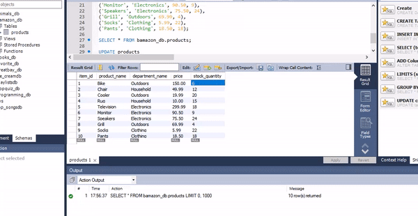

# Bamazon

## Customer View

- App displays all available items in Bamazon DataBase
- Customer is then asked to select an item they wish to purchase
- Customer enters item id and desired quantity
  _*If quantity desired exceeds what is in stock, customer will be asked to select again_
- Once customer purchase is complete, the Bamazon DataBase is updated and purchase information is displayed

## Manager View

- If a manager selects `View Products for Sale`, the app lists every available item: the item IDs, names, prices, and quantities.

- If a manager selects `View Low Inventory`, the app lists all items with an inventory count lower than five.

- If a manager selects `Add to Inventory`, the app displays a prompt that will let the manager "add more" of any item currently in the store.

- If a manager selects `Add New Product`, the add allows manager to add a completely new product to the database.

## Supervisor View

__Coming Soon...__
